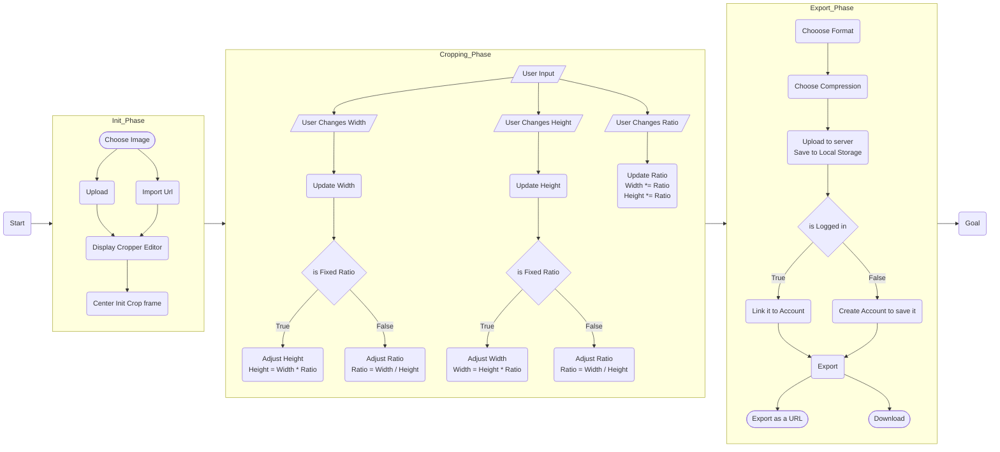

# User Journey

---

```mermaid
flowchart LR
	A(Start) --> Init_Phase
	subgraph Init_Phase
		B([Choose Image]) --> B_a(Upload) & B_b(Import Url)
     	B_a & B_b --> D(Display Cropper Editor)
     	D --> E(Center Init Crop frame)
   end

    subgraph Cropping_Phase
    	F[/ User Input /]
    	F --> G[/ User Changes Width/]
        	G --> G_a(Update Width)
        	G_a --> G_b{is Fixed Ratio}
        	G_b --True--> G_c(Adjust Height <br/> Height = Width * Ratio)
        	G_b --False--> G_d(Adjust Ratio <br/> Ratio = Width / Height)
    	F --> H[/ User Changes Height/]
        	H --> H_a(Update Height)
        	H_a --> H_b{is Fixed Ratio}
        	H_b --True--> H_c(Adjust Width <br/> Width = Height * Ratio)
        	H_b --False--> H_d(Adjust Ratio <br/> Ratio = Width / Height)
    	F --> I[/ User Changes Ratio/]
        	I --> I_a(Update Ratio <br/> Width *= Ratio <br/> Height *= Ratio)
    end

	subgraph Export_Phase
		J(Chooose Format) --> K(Choose Compression)
		K --> L(Upload to server <br/> Save to Local Storage)
		L --> M{is Logged in}
		M --True--> M_a(Link it to Account)
		M --False--> M_b(Create Account to save it)
		M_a & M_b --> N(Export)
		N --> N_a([Export as a URL])
		N --> N_b([Download])

    end

    Init_Phase --> Cropping_Phase --> Export_Phase --> Z(Goal)

```
